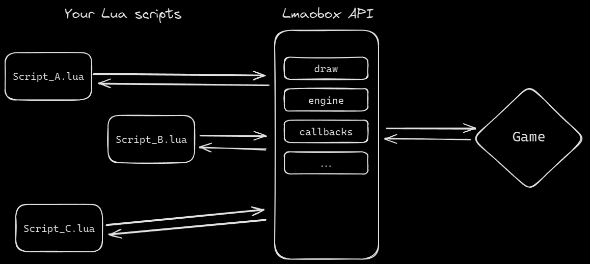

# Home

The Lmaobox Lua API enables players and developers to enhance and expand their game by implementing their own ideas, features, visuals, and customizations.

## Community

If you want to contribute, share suggestions, report a problem, or report a bug, feel free to join the discussion on our
 [Discord](https://discord.gg/CwG7VkhSSm) and [Telegram group](https://t.me/+7LzWi43kypZjYWNk) 

 You can share and download Lua scripts on our [Forum](
 https://lmaobox.net/forum/v/categories/lua-scripts) 

## IDE

We recommend using [Visual Studio Code](https://code.visualstudio.com) with those extensions:

- [Lmaobox Lua Annotations](https://github.com/lnx00/Lmaobox-Annotations?tab=readme-ov-file) - static code analysis, type checking and autocompletion.

- [Lmaobox LUA snippets addon](https://marketplace.visualstudio.com/items?itemName=RC.lmaobox-lua-api-snippets) - autocompletion addon.

If you are using Open AI you can access API via [http://lmaobox.net/lua/sitemap.xml](http://lmaobox.net/lua/sitemap.xml)

## Learning Lua

You can start learning Lua by following the friendly tutorial made by Garry's Mod developers: 

- [Garry's Mod Lua Tutorial](https://wiki.facepunch.com/gmod/Beginner_Tutorial_If_Then_Else)

Or any of the following guides for example:

- [Lua.org Tutorial](https://www.lua.org/pil/1.html)
- [Tutorialspoint Tutorial](https://www.tutorialspoint.com/lua/lua_overview.htm)

## How to start

1. Make sure you have Lmaobox loaded

2. Create example.lua file in your %localappdata%/lua/ folder and save your code there

3. Execute the script ingame using console command:

        lua_load example.lua

    Note it is also possible to execute lua code directly using:

        lua print( "Hello World" )


## Interaction overview diagram



## Top Examples

```lua title="FPS Counter - by x6h"
local consolas = draw.CreateFont("Consolas", 17, 500)
local current_fps = 0

local function watermark()
  draw.SetFont(consolas)
  draw.Color(255, 255, 255, 255)

  -- update fps every 100 frames
  if globals.FrameCount() % 100 == 0 then
    current_fps = math.floor(1 / globals.FrameTime())
  end

  draw.Text(5, 5, "[lmaobox | fps: " .. current_fps .. "]")
end

callbacks.Register("Draw", "draw", watermark)
-- https://github.com/x6h
```

```lua title="Damage logger - by @RC"
local function damageLogger(event)

    if (event:GetName() == 'player_hurt' ) then
        
        local localPlayer = entities.GetLocalPlayer();
        local victim = entities.GetByUserID(event:GetInt("userid"))
        local health = event:GetInt("health")
        local attacker = entities.GetByUserID(event:GetInt("attacker"))
        local damage = event:GetInt("damageamount")
        
        if (attacker == nil or localPlayer:GetIndex() ~= attacker:GetIndex()) then
            return
        end

        print("You hit " ..  victim:GetName() .. " or ID " .. victim:GetIndex() .. " for " .. damage .. "HP they now have " .. health .. "HP left")
    end

end

callbacks.Register("FireGameEvent", "exampledamageLogger", damageLogger)
-- Made by @RC
```

``` lua title="Basic player ESP"
local myfont = draw.CreateFont( "Verdana", 16, 800 )

local function doDraw()
    if engine.Con_IsVisible() or engine.IsGameUIVisible() then
        return
    end

    local players = entities.FindByClass("CTFPlayer")

    for i, p in ipairs( players ) do
        if p:IsAlive() and not p:IsDormant() then

            local screenPos = client.WorldToScreen( p:GetAbsOrigin() )
            if screenPos ~= nil then
                draw.SetFont( myfont )
                draw.Color( 255, 255, 255, 255 )
                draw.Text( screenPos[1], screenPos[2], p:GetName() )
            end
        end
    end
end
 
callbacks.Register("Draw", "mydraw", doDraw) 
```